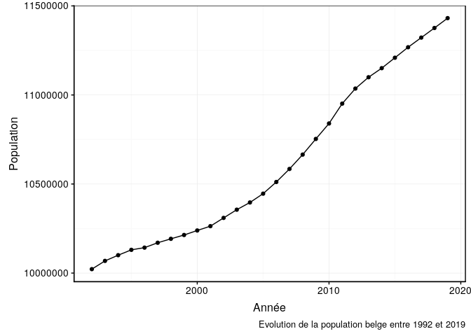
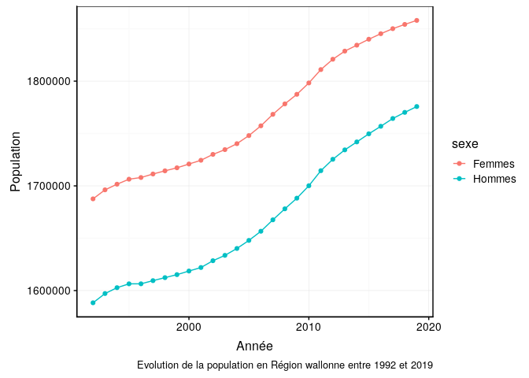

```{r setup, include=FALSE}
knitr::opts_chunk$set(echo = TRUE)
```

<!---Do not edit README.md --->

## contexte


L'office belge de statistique , Statbel, diffuse des données fiables sur l'économie, la société et le territoires belges.

Pour en apprendre plus sur l'office belge de statistique, vous pouvez consulter le lien suivant : <https://statbel.fgov.be/fr/propos-de-statbel>

Nous souhaitons réaliser des graphiques sur l'évolution de la population belge entre le 1 janvier 1992 et le le 1 janvier 2019.

## Module 5 et 6

Durant le module 5 et 6 vous avez appris à remanier des tableaux de données afin de pouvoir les exploiter au mieux. 

Le projet mis à votre disposition ce décompose en plusieurs fichiers suivant l'arborescence ci-dessous : 
 
```{r}
fs::dir_tree()
```

Dans ce dossier data vous pouvez retrouver la densité de population dans 6 fichiers distincs :

- region_bxl_ap_2000.rds : recensement de la population de la région de Bruxelles capitale après les années 2000
- region_bxl_av_2000.rds : recensement de la population de la région de Bruxelles capitale avant les années 2000
- region_flamande_ap_2000.xls : recensement de la population de la Région flamande apres les années 2000
- region_flamande_av_2000.xls : recensement de la population de la Région flamande avant les années 2000
- region_wallonne_ap_2000.csv : recensement de la population de la Région wallonne apres les années 2000
- region_wallonne_av_2000.csv : recensement de la population de la Région wallonne avant les années 2000

> Dans un premier script R, vous devez regrouper les 6 jeux de données en un seul et faire une sauvegarde de ce jeu de données unique.


> Dans un second script R, vous devez reproduire les trois graphique ci-dessous 






**Note:**  N'oubliez pas de commenter votre code afin qu'ils soient facilement compréhensibles par un collaborateur ou par vous-même dans plusieurs semaines.

> Dans un dossier analysis, créez un fichier au format .Rmd. Proposez une mise en contexte des données suivi d'une description via des graphiques et des tableaux résumant l'information. Interessez vous au moins à une année précise. Ce document  doit contenir aux minimums 3 graphiques pertinents et commentés (ces trois graphiques ne peuvent pas être les trois graphiques de la première partie de l'exercice).

